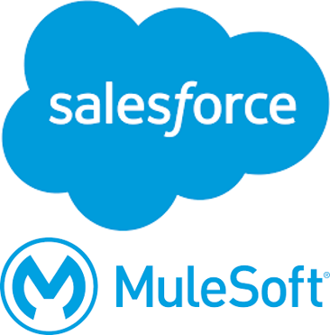

# API-Storage-Mangement
Specification of APIs to maintain and manage products in a warehouse
<a id="readme-top"></a>

[![Contributors][contributors-shield]][contributors-url]
[![Forks][forks-shield]][forks-url]
[![Stargazers][stars-shield]][stars-url]
[![Issues][issues-shield]][issues-url]
[![Unlicense License][license-shield]][license-url]
[![LinkedIn][linkedin-shield]][linkedin-url]

<!-- PROJECT LOGO -->
<br />
<div align="center">
  <a href="https://github.com/TranDuyNgocBao/API-Storage-Mangement">
    
  </a>

  <h3 align="center">How-To-Run-Application-README</h3>

  <p align="center">
    How to run my application in Anypoint Studio!
    <br />
    <a href="https://github.com/TranDuyNgocBao/API-Storage-Mangement"><strong>Explore the docs »</strong></a>
    <br />
    <br />
    <a href="https://github.com/TranDuyNgocBao/API-Storage-Mangement">Demo</a>
    &middot;
    <a href="https://github.com/TranDuyNgocBao/API-Storage-Mangement/issues/new?labels=bug&template=bug-report---.md">Report Bug</a>
    &middot;
    <a href="https://github.com/TranDuyNgocBao/API-Storage-Mangement/issues/new?labels=enhancement&template=feature-request---.md">Request Feature</a>
  </p>
</div>

<!-- TABLE OF CONTENTS -->
<details>
  <summary>Table of Contents</summary>
  <ol>
    <li>
      <a href="#about-the-project">About The Project</a>
      <ul>
        <li><a href="#built-with">Built With</a></li>
      </ul>
    </li>
    <li>
      <a href="#getting-started">Getting Started</a>
      <ul>
        <li><a href="#prerequisites">Prerequisites</a></li>
        <li><a href="#installation">Installation</a></li>
      </ul>
    </li>
    <li><a href="#usage">Usage</a></li>
    <li><a href="#roadmap">Roadmap</a></li>
    <li><a href="#contributing">Contributing</a></li>
    <li><a href="#license">License</a></li>
    <li><a href="#contact">Contact</a></li>
  </ol>
</details>

<!-- ABOUT THE PROJECT -->
## About The Project

[![Product Name Screen Shot][product-screenshot]](https://example.com)

This is an application I made using the tools provided by MuleSoft: Anypoint Platform and Anypoint Studio.

Key Features:
* Add, update, retrieve and delete products in inventory.
* Create import and export requests, edit, retrieve and delete invoices
* Interaction between APIs makes management efficient and seamless.

<p align="right">(<a href="#readme-top">back to top</a>)</p>

### Built With

This section should list any major frameworks/libraries used to bootstrap your project. Leave any add-ons/plugins for the acknowledgements section. Here are a few examples.

* [![MuleSoft][Anypoint.mulesoft]][Mule-url]
* [![RESTful-API][RAML]][Raml-url]
* [![HTML][HTML]][Html-url]
* [![CSS][CSS]][Css-url]

<p align="right">(<a href="#readme-top">back to top</a>)</p>

<!-- GETTING STARTED -->
## Getting Started

To run the application, follow these steps.

### Prerequisites

Download tool to run the application
* Anypoint Studio
  ```sh
   install anypoint studio
  ```
    [![Anypoint Studio Installation][install-screenshot]](https://www.mulesoft.com/lp/dl/anypoint-mule-studio)

### Installation

_Steps to run the application._

1. Open Anypoint Studio
2. `window > perspective > Open Perspective > Other... > Git`
3. Clone the repo
   ```sh
   git clone https://github.com/TranDuyNgocBao/API-Storage-Mangement.git
   ```
4. Change git remote url to avoid accidental pushes to base project
   ```sh
   git remote set-url origin github_username/repo_name
   git remote -v # confirm the changes
   ```
5. `Run > Run Configurations...`: Set up to run three applications at the same time, providing Arguments `env` as local and `enc.key` as `abcdef0123456789`
    ```sh
   -Denv=local
   -Denc.key=abcdef0123456789
   ```

<p align="right">(<a href="#readme-top">back to top</a>)</p>

## Usage

This is a sample project that allows the design to call APIs to interact with the database and users. Also integrates cloud and JMS related tools.

_For more examples, please refer to the [Documentation](https://example.com)_

<p align="right">(<a href="#readme-top">back to top</a>)</p>

<!-- ROADMAP -->
## Roadmap

- [x] Product Application
- [x] Purchases Application
- [x] Sales Application
- [x] Salesforce
- [x] CloudHub
- [x] JMS
- [ ] Handling multiple data fields
- [ ] Link employee information and applications
- [ ] Multi-language Support
    - [ ] Spanish
    - [ ] Japanese

See the [open issues](https://github.com/TranDuyNgocBao/API-Storage-Mangement/issues) for a full list of proposed features (and known issues).

<p align="right">(<a href="#readme-top">back to top</a>)</p>

<!-- CONTRIBUTING -->
## Contributing

Contributions are what make the open source community such an amazing place to learn, inspire, and create. Any contributions you make are **greatly appreciated**.

If you have a suggestion that would make this better, please fork the repo and create a pull request. You can also simply open an issue with the tag "enhancement".
Don't forget to give the project a star! Thanks again!

1. Fork the Project
2. Create your Feature Branch (`git checkout -b feature/AmazingFeature`)
3. Commit your Changes (`git commit -m 'Add some AmazingFeature'`)
4. Push to the Branch (`git push origin feature/AmazingFeature`)
5. Open a Pull Request

### Top contributors:

<a href="https://github.com/TranDuyNgocBao/API-Storage-Mangement/graphs/contributors">
  
</a>

<p align="right">(<a href="#readme-top">back to top</a>)</p>

<!-- LICENSE -->
## License

Distributed under the Unlicense License. See `LICENSE.txt` for more information.

<p align="right">(<a href="#readme-top">back to top</a>)</p>

<!-- CONTACT -->
## Contact

Owner - [@Clint-Chan](baongoctranduy278201@gmail.com)

Project Link: [https://github.com/TranDuyNgocBao/API-Storage-Mangement](https://github.com/TranDuyNgocBao/API-Storage-Mangement.git)

<p align="right">(<a href="#readme-top">back to top</a>)</p>

<!-- ACKNOWLEDGMENTS -->
<!-- ## Acknowledgments

Use this space to list resources you find helpful and would like to give credit to. I've included a few of my favorites to kick things off!

* [Choose an Open Source License](https://choosealicense.com)
* [GitHub Emoji Cheat Sheet](https://www.webpagefx.com/tools/emoji-cheat-sheet)
* [Malven's Flexbox Cheatsheet](https://flexbox.malven.co/)
* [Malven's Grid Cheatsheet](https://grid.malven.co/)
* [Img Shields](https://shields.io)
* [GitHub Pages](https://pages.github.com)
* [Font Awesome](https://fontawesome.com)
* [React Icons](https://react-icons.github.io/react-icons/search)

<p align="right">(<a href="#readme-top">back to top</a>)</p> -->

<!-- MARKDOWN LINKS & IMAGES -->
<!-- https://www.markdownguide.org/basic-syntax/#reference-style-links -->
[contributors-shield]: https://img.shields.io/github/contributors/TranDuyNgocBao/API-Storage-Mangement.svg?style=for-the-badge
[contributors-url]: https://github.com/TranDuyNgocBao/API-Storage-Mangement/graphs/contributors
[forks-shield]: https://img.shields.io/github/forks/TranDuyNgocBao/API-Storage-Mangement.svg?style=for-the-badge
[forks-url]: https://github.com/TranDuyNgocBao/API-Storage-Mangement/network/members
[stars-shield]: https://img.shields.io/github/stars/TranDuyNgocBao/API-Storage-Mangement.svg?style=for-the-badge
[stars-url]: https://github.com/TranDuyNgocBao/API-Storage-Mangement/stargazers
[issues-shield]: https://img.shields.io/github/issues/TranDuyNgocBao/API-Storage-Mangement.svg?style=for-the-badge
[issues-url]: https://github.com/TranDuyNgocBao/API-Storage-Mangement/issues
[license-shield]: https://img.shields.io/github/license/TranDuyNgocBao/API-Storage-Mangement.svg?style=for-the-badge
[license-url]: https://github.com/TranDuyNgocBao/API-Storage-Mangement/blob/master/LICENSE.txt
[linkedin-shield]: https://img.shields.io/badge/-LinkedIn-black.svg?style=for-the-badge&logo=linkedin&colorB=555
[linkedin-url]: https://www.linkedin.com/in/batoran
[product-screenshot]: usage/712-release-pic.png
[install-screenshot]: usage/anypoint-studio-install.png
[Mule-url]: https://anypoint.mulesoft.com/login
[Anypoint.mulesoft]: https://img.shields.io/badge/MuleSoft-Anypoint-blue?style=for-the-badge&logo=mulesoft
[RAML]: https://img.shields.io/badge/RESTful-API-blue?style=for-the-badge
[Raml-url]: https://restfulapi.net/
[HTML]: https://img.shields.io/badge/HTML-grey?style=for-the-badge&logo=html5
[Html-url]: https://en.wikipedia.org/wiki/HTML
[CSS]: https://img.shields.io/badge/CSS-red?style=for-the-badge&logo=css
[Css-url]: https://developer.mozilla.org/en-US/docs/Web/CSS